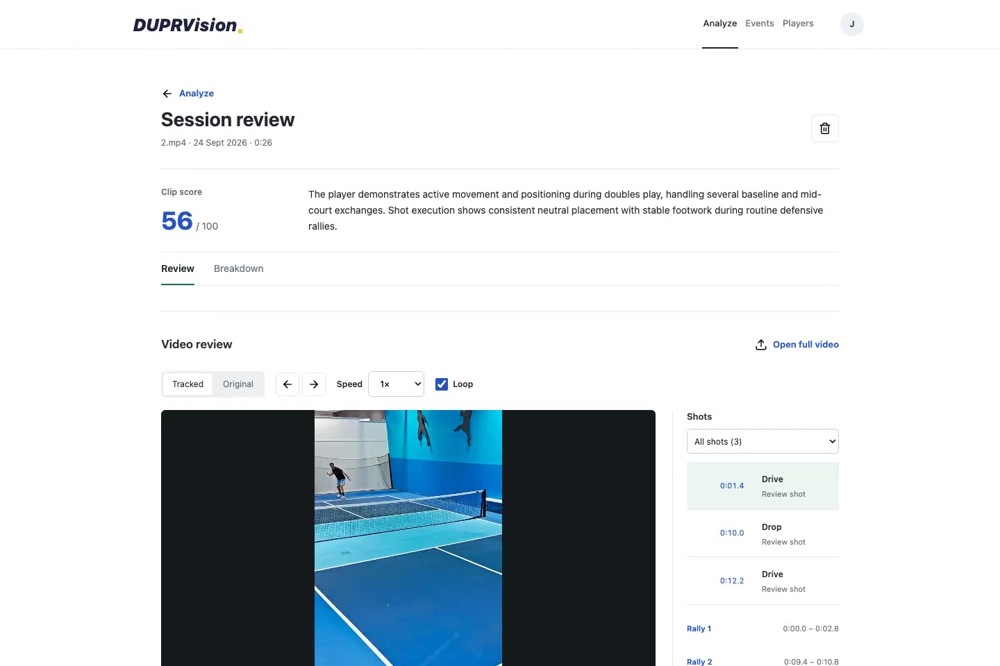

# DUPRVision

Review your pickleball footage, follow your progress, and organize the next game.

[Watch the demo](docs/demo.mp4) · [Quick start](#quick-start) · [Analysis modes](#analysis-modes) · [Deployment](#deployment) · [Development](#development)

[](docs/demo.mp4)

## The App

Three destinations keep video review, scheduling, and people separate.

| Destination | What you can do |
| --- | --- |
| **Analyze** | Upload a clip, select a player, review shots and rallies, replay tracked moments, save private notes, and view daily progress. |
| **Events** | Share a court and time, browse the calendar, or organize a doubles round robin with players, courts, scores, and standings. |
| **Players** | Find discoverable players, follow their activity, and manage connections. |

Account settings are available from the profile control. The responsive web app supports desktop and mobile browsers and can be added to a phone's home screen. Native App Store and Play Store packages are not included.

### Video Review

- MP4, MOV, and M4V uploads, up to **100 MB and three minutes**. Short clips are accepted.
- Three reference frames for selecting the player; permission is required before analysis.
- Shot observations, rally timestamps, a concise summary, and a practice focus when supported by the evidence.
- Tracked replays with slow motion, frame stepping, shot filters, and an Original view.
- Optional retention of up to three private six-second replays and annotated frames.
- Private notes and report corrections. Feedback does not silently change a saved score.

The full upload is deleted after successful review. You can reopen the original file locally in the browser for full-length playback without uploading or analyzing it again.

### What the Score Means

The **clip score is 0-100**, calculated locally from the reviewed observations: **70% shot control, 15% balance, and 15% recovery**. Confidence weighting and small-sample stabilization reduce extreme scores from a few easy shots.

A score requires enough observable evidence. Tracking a person alone does not establish ball contact, shot quality, or playing ability. When evidence is insufficient, the report can be available without a score.

Progress averages scored days equally, excludes recognized duplicate evidence, and does not mix scoring versions. Historical reports remain readable.

**This is not an official DUPR rating or a validated estimate of overall skill.** Camera angle, clip length, occlusion, and model errors affect the observations. DUPRVision is independent of DUPR.

[Scoring rules and limitations](docs/scoring.md)

### Events and Round Robins

Create a **Play session** for open play, practice, lessons, league play, tournaments, or a DUPR match. Search for a venue, choose a map pin, or enter an unlisted location manually. Times appear in the viewer's local time zone.

Ordinary plans can be private or visible to followers of a discoverable profile. This is a schedule, not live location tracking or court booking.

Create a **Round robin** for rotating partners or fixed teams. Organizers can run an event without playing, invite members, add guests, manage attendance, and assign named or unnamed courts. All matches in a round must be resolved before the next round starts. Players can submit scores for opponent confirmation; organizers resolve disputes and forfeits.

Events support up to 32 roster entries and eight courts. Scheduling uses a local solver, not a language model. Event results do not update DUPR or video scores.

[Round-robin guide](docs/round-robin.md)

## Demo

[Watch the current end-to-end demo](docs/demo.mp4) (**1:43**, H.264 MP4).

The recording uses both supplied clips, `1.mp4` and `2.mp4`, in an isolated demo account. It shows uploads, player selection, completed analyses, moving tracking overlays, score breakdowns, daily progress, event creation, round-robin scoring, and following another player.

The actual recorded results were **64/100 from nine assessed shots** and **56/100 from three assessed shots**. These are observations from those runs, not expected results or accuracy benchmarks. Long processing and retry waits are cut; report values are unchanged. The demo includes a resumed capture after a temporary provider delay.

Only the edited app recording and its preview are included here. The original gameplay files, private database, provider responses, and raw recordings are not committed.

## Quick Start

**Requirements:** Python 3.11, FFmpeg and FFprobe on your PATH, and sufficient disk space for Python dependencies, model weights, and temporary video processing. Start with at least 5 GB free. The supplied launch scripts target macOS/Linux; Windows requires a compatible Linux environment such as WSL.

On macOS, install FFmpeg first:

```sh
brew install ffmpeg
```

From the repository root:

```sh
./scripts/bootstrap.sh
./scripts/start.sh
```

Open [http://127.0.0.1:3000](http://127.0.0.1:3000).

Bootstrap creates `.venv` and `.env`, installs runtime dependencies, initializes SQLite, and downloads the YOLO weights. Start launches the API and analysis worker together. There is no frontend build step; opening `static/index.html` directly does not run the app.

**The default mode is local pose review.** For shot analysis and clip scores, configure a video-review provider below, then restart.

## Analysis Modes

| Mode | Requires | Produces |
| --- | --- | --- |
| `local` | Downloaded YOLO weights; no provider key | Player visibility and possible stroke motions. **No shot-outcome score.** |
| `gemini` | Owner's Gemini API key and uploader consent | Structured shot/rally review, followed by local validation and scoring. |
| `self_hosted` | Your own compatible video-model server | The same review contract and scoring path, without a Gemini dependency. Quality depends on the model you operate. |

### Gemini

Edit `.env`:

```dotenv
ANALYSIS_ENGINE=gemini
GEMINI_API_KEY=your-key
GEMINI_MODEL=gemini-3.5-flash-lite
```

The browser never receives the key. Each uploader must authorize sending the review video and selection frame to Google. The server creates a silent 5-fps review copy capped at 12 MiB, with selected-player outlines where local tracking is available.

### Self-Hosted

```dotenv
ANALYSIS_ENGINE=self_hosted
SELF_HOSTED_VLM_URL=http://127.0.0.1:8000/v1
SELF_HOSTED_VLM_MODEL=your-video-model
SELF_HOSTED_VLM_REVISION=1
```

The server must support the OpenAI-compatible chat-completions protocol with base64 MP4 `video_url`, image input, and JSON-schema output. This uses HTTP directly; the OpenAI SDK and an OpenAI account are not required.

DUPRVision does not bundle or start the model server. Set `SELF_HOSTED_VLM_TOKEN` when the endpoint requires authentication. Increment the revision after changing model weights or inference settings. No self-hosted model is certified here as an accuracy-equivalent replacement.

[Analysis configuration and recovery](docs/analysis.md) · [Local-model research](docs/local-analysis.md)

## Data and Privacy

| Data | Default location and lifetime |
| --- | --- |
| Accounts, sessions, follows, events, reports | `data/duprvision.sqlite3`; persisted locally |
| Original and normalized uploads | `data/uploads/`; deleted after successful review |
| Abandoned or failed media | Expires after 24 hours without updates |
| Opted-in frames and short replays | `data/evidence/`; retained until report deletion |
| Full-video browser playback | Local file reference; cleared on sign-out, replacement, or reload |

Videos, replays, email, and private notes are owner-only. Discoverability exposes the player's name, activity, and social counts to signed-in members. Round-robin invitations grant event membership separately from ordinary follower visibility.

Set `DUPRVISION_DATA_DIR` before starting the app to use another storage directory. Keep that directory and `.env` out of Git. Use only footage you have permission to process and publish.

## Deployment

The current architecture is **one API process, one bounded-concurrency worker process, SQLite, and local media storage**. It suits development and small controlled deployments; this cleanup does not make it a multi-tenant service ready for unrestricted public traffic.

For an always-on deployment, run the API and worker on an always-on host with persistent storage, supervised restarts, HTTPS, backups, and monitoring. A Cloudflare Worker can proxy the app, but it does not run the Python worker or replace the origin server.

`./scripts/share.sh` creates a temporary tunnel. The machine behind it must stay awake and online. The optional `cloudflare/` proxy and `scripts/public.py` support a stable Worker address; account-specific configuration is intentionally ignored by Git.

Before an unrestricted public launch, add account verification/recovery, stronger abuse controls, operational alerting, tested backup restoration, and a privacy/retention review. Move beyond SQLite and local media before deploying multiple hosts. Model accuracy also needs evaluation against human-reviewed pickleball footage.

[Operations and deployment checklist](docs/operations.md) · [Scaling architecture](docs/architecture.md)

## Development

Install development tools separately:

```sh
.venv/bin/python -m pip install -r requirements-dev.txt
npm ci
```

Run backend checks and the edge-proxy tests:

```sh
.venv/bin/python -m pytest -q
.venv/bin/ruff check duprvision scripts tests
npm run test:edge
```

Browser tests use Playwright and a **disposable database**, never your normal app data:

```sh
PYTHONPATH=. DUPRVISION_DATA_DIR=/tmp/duprvision-ui .venv/bin/python tests/ui_fixture.py
DUPRVISION_DATA_DIR=/tmp/duprvision-ui .venv/bin/python -m uvicorn duprvision.app:app --port 3017
```

In another terminal, run `npm run test:ui`. Tests default to installed Google Chrome on macOS; set `CHROME_PATH` to your browser executable on other systems. Additional suites cover selection, replay, maps, social connections, and round robins.

[Testing and demo recording](docs/development.md)

### Repository Map

```text
duprvision/    API, accounts, jobs, tracking, review, scoring, and events
static/        Browser interface, styles, icons, and vendored map library
tests/         Backend tests, browser workflows, and isolated fixtures
scripts/       Local startup, sharing, diagnostics probe, and demo recorder
cloudflare/    Optional edge proxy, tests, and example configuration
docs/          Demo, scoring, operations, architecture, and research notes
```

Runtime dependencies are in `requirements.txt`; test/lint tools are in `requirements-dev.txt`. Node is for development and optional Cloudflare tooling, not the Python app runtime.

## License

Application source is licensed under [AGPL-3.0](LICENSE). YOLO weights, Leaflet, icons, model weights, and gameplay footage retain their respective terms. Third-party notices are kept beside vendored assets. Review the applicable licenses before redistribution or commercial deployment.
