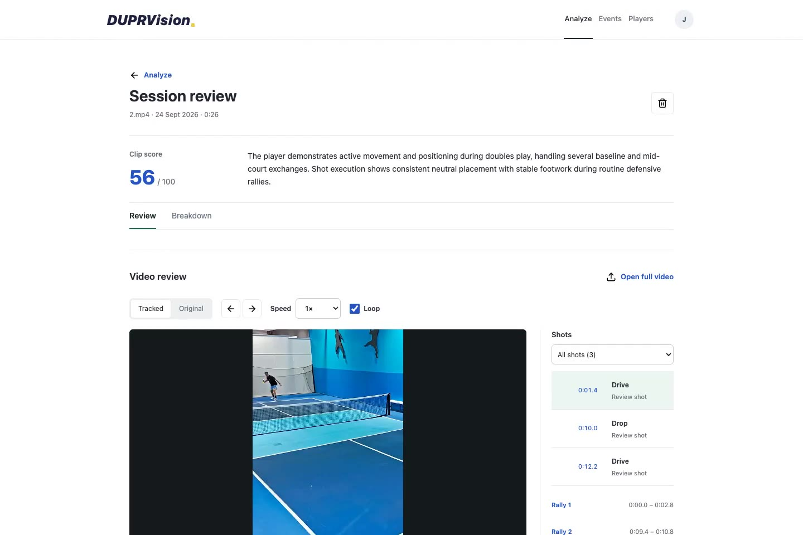

# Pickleball Video Review

DUPRVision combines pickleball footage review, practice tracking, and game scheduling. Upload a short clip, select a player, and review the observations alongside the video.

[](docs/demo.mp4)

[Watch the demo](docs/demo.mp4) · [Full product guide](docs/product-guide.md) · [Scoring and limitations](docs/scoring.md)

## What works

- Video uploads with player selection, tracked replay, and private review notes.
- Optional shot and rally analysis through a configured video-model provider.
- Progress history, player connections, events, and doubles round robins.
- Local accounts, a background analysis worker, and SQLite persistence.

The default local mode reviews player visibility and possible stroke motions. It does **not** produce a shot-outcome score. Provider-backed modes can produce a clip score when there is enough evidence.

**Clip scores are not official DUPR ratings or validated estimates of overall playing ability.** This project is independent of DUPR.

## Run locally

Requirements: Python 3.11, FFmpeg/FFprobe, and at least 5 GB of free disk space. The scripts target macOS/Linux; Windows needs a compatible environment such as WSL.

```sh
git clone https://github.com/pranavreddyg17/pickleball-dupr-vision.git
cd pickleball-dupr-vision
# macOS, if FFmpeg is not installed:
brew install ffmpeg
./scripts/bootstrap.sh
./scripts/start.sh
```

Open <http://127.0.0.1:3000>. Bootstrap creates the local environment and downloads the model weights. Review `.env` to choose `local`, `gemini`, or `self_hosted` analysis. See [provider setup](docs/product-guide.md#analysis-modes) for requirements and consent behavior.

## How it is organized

| Directory | Purpose |
| --- | --- |
| `duprvision/` | API, accounts, analysis, scoring, and event scheduling |
| `static/` | Browser interface and assets |
| `tests/` | Backend and browser checks |
| `scripts/` | Setup, workers, sharing, and demo recording |
| `cloudflare/` | Optional edge proxy |
| `docs/` | Demo, model limitations, and operating guides |

The application uses one API process, one analysis worker, SQLite, and local media storage. It suits local use and small controlled deployments. A public multi-host service would need further operational work and a different persistence plan.

## Check changes

```sh
.venv/bin/python -m pip install -r requirements-dev.txt
npm ci
.venv/bin/python -m pytest -q
.venv/bin/ruff check duprvision scripts tests
npm run test:edge
```

Browser tests require a disposable database and a running fixture server. Follow [the development guide](docs/development.md).

## Data and limitations

Use footage you have permission to process. Provider-backed review sends a prepared clip to the configured provider after uploader consent. Uploads and retained evidence follow the [documented retention rules](docs/product-guide.md#data-and-privacy).

Camera placement, occlusion, short clips, and model errors affect the review. The demo illustrates actual runs; its scores are not an accuracy benchmark.

## Documentation and license

[Analysis setup](docs/analysis.md) · [Round robins](docs/round-robin.md) · [Deployment](docs/operations.md) · [Architecture](docs/architecture.md)

Application source is licensed under [AGPL-3.0](LICENSE). Model weights, footage, and bundled third-party assets retain their respective terms and notices.
